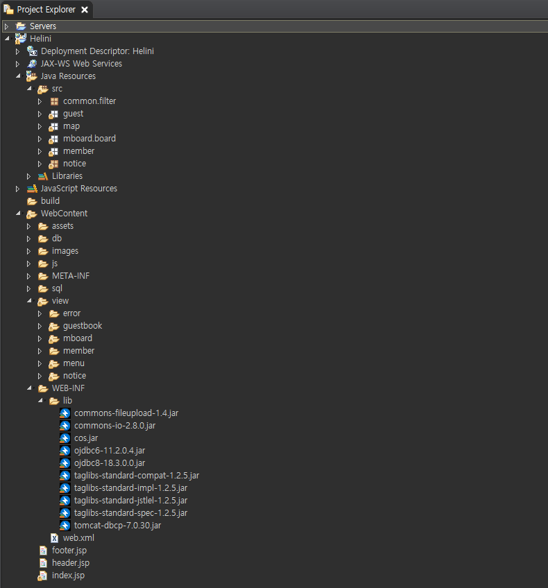
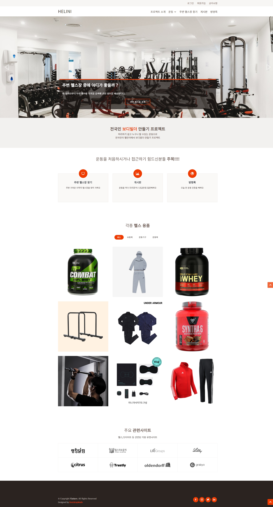
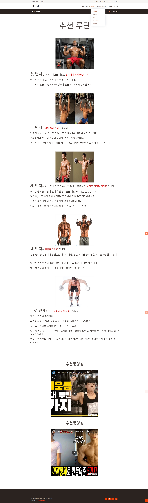
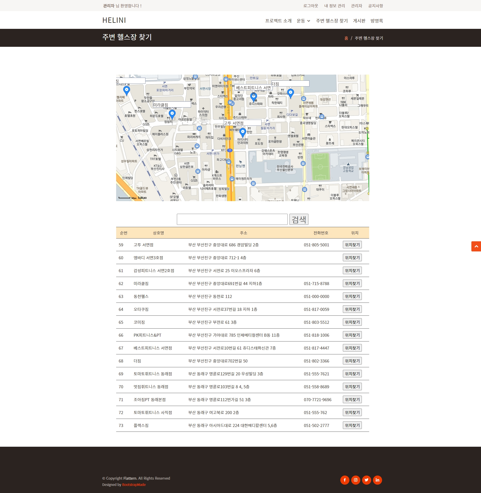
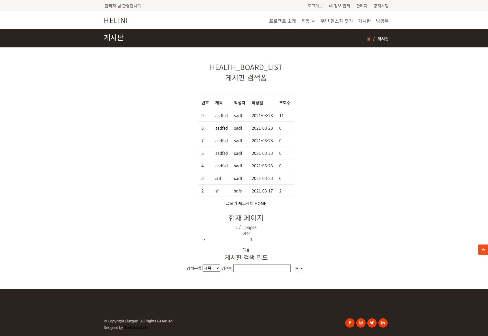
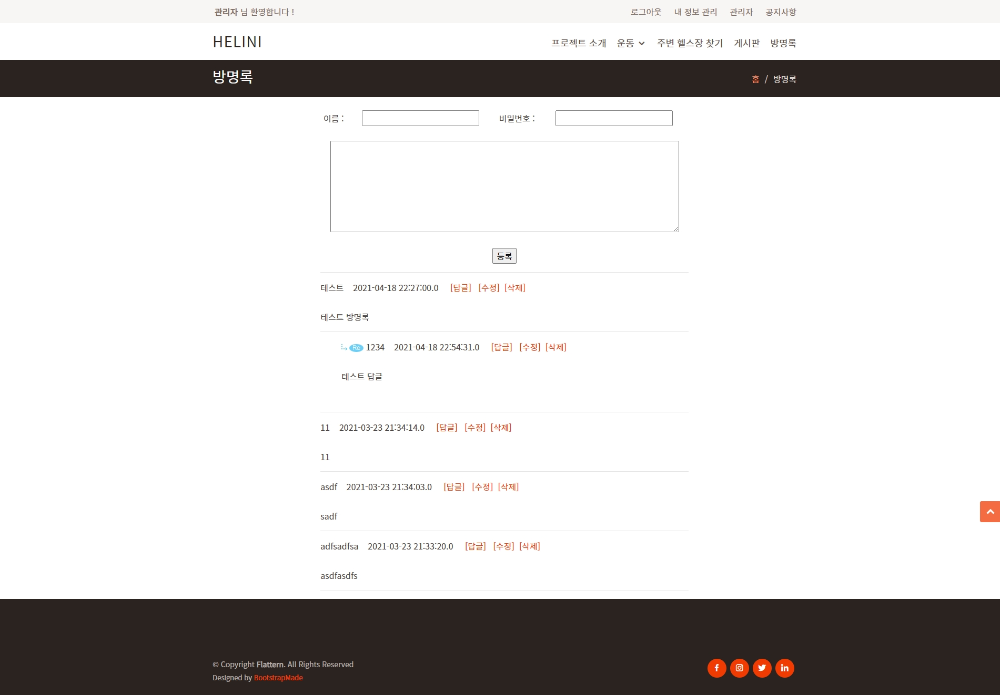
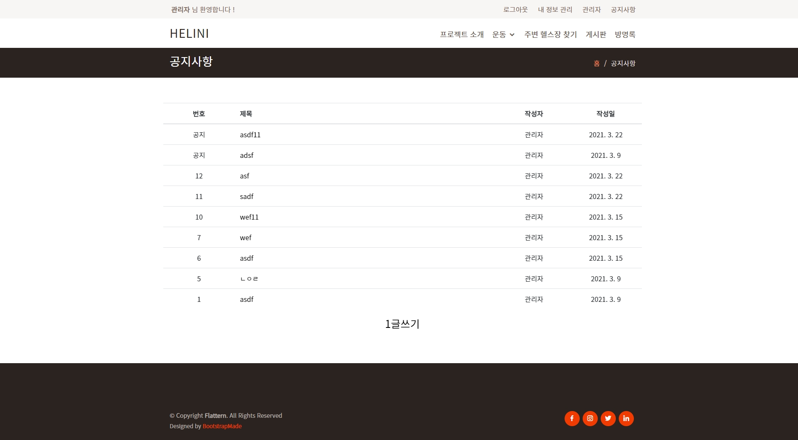

# JSP 프로젝트

## 팀
- 곽대희: 팀장, 회원 기능, 공지사항 게시판 기능, 프론트단 디자인
- 송현우: 주변 헬스장 찾기 기능, 운동 관련 각종 컨텐츠 추가
- 이동준: 방명록 게시판 기능
- 최성완: 커뮤니티 게시판 기능

## 프로젝트
- 헬스 및 운동 관련 정보를 제공하는 커뮤니티; HELINI
- Java Servlet, JSP API를 이용하여 웹 사이트 제작

## 제작기간
2021-02-26 ~ 2021-03-25

## 제작환경
- SDK: Oracle JDK 1.8 // Java
- IDE: Eclipse 2019-06
- DBMS Client: SQL Developer
- DBMS Server: Oracle Database 11g Express Edition
- WS & WAS : Apache, Tomcat 9

## 실행화면

# SPRING 프로젝트

## 프로젝트
- 캠핑 관련 정보를 제공하는 커뮤니티; GOCAMPING
- Java Spring Framework을 이용하여 웹 사이트 제작

## 제작기간
2021-04-01 ~ 2021-05-01

## 제작환경
- SDK: Oracle JDK 1.8 // Java
- IDE: Eclipse 2019-06
- DBMS Client: SQL Developer
- DBMS Server: Oracle Database 11g Express Edition
- WS & WAS : Apache, Tomcat 9
- STORAGE : Google Firebase
